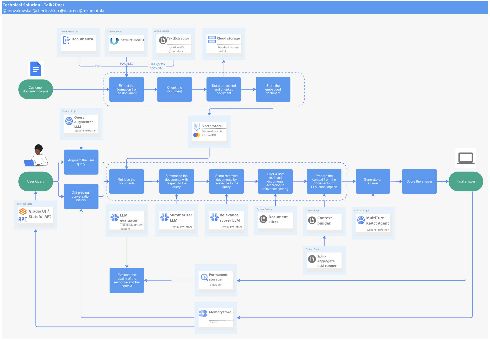

# Solution Accelerators for GenAI
This repository contains platform code for accelerating development of GenAI solutions in Applied AI Engineering team

# Structure

- **gen_ai**: The source code for the GenAI solution accelerators is located here. This is where you'll find the core codebase for the tools and frameworks provided in this repository.
  - **gena_ai/tests**: Test cases and resources related to testing the GenAI solution accelerators are stored in this directory.
  - **gena_ai/extraction_pipeline**: Framework to extract valuable data from various document formats, that is used to create data store later in the flow.

- **terraform**: This directory contains terraform files required for the infrastructure deployment.

## Getting Started

To get started with the GenAI solution accelerators, follow the instructions in the terraform deployment [instructions](terraform/README.md). 
It will provide you with step-by-step guidance on how to set up your environment.

## Contribution Guidelines

We welcome contributions from the GenAI community! If you'd like to contribute to this repository, please follow our [Contribution Guidelines](CONTRIBUTING.MD) to ensure a smooth collaboration process.

## License

This repository is licensed under the [Apache License](LICENSE). See the [LICENSE](LICENSE) file for details.

## Contact

If you have any questions or need assistance, feel free to reach out to the project maintainers or create an issue in this repository.

Happy GenAI development!

## Setting up
To begin development you can use 2 different approaches: using Python Environment or using Docker. Below are instructions for each approach.

For extraction pipeline, check this [guide](gen_ai/extraction_pipeline/README.md)